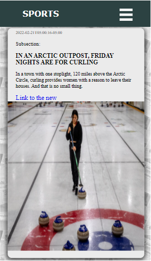

# SPORTS Nespapper
This app was created with react.

## Technologies
HTML5, SCSS, JavaScript, Axios, React.

## Available Scripts

In the project directory, you can run:

### `npm start`

Runs the app in the development mode.\
Open [http://localhost:3000](http://localhost:3000) to view it in your browser.

The page will reload when you make changes.\
You may also see any lint errors in the console.

# Images

### PC principal view

### Mobile phone principal view

### PC form view

### Mobile form view

